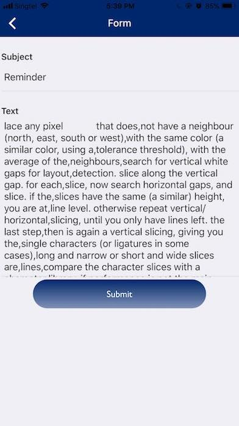
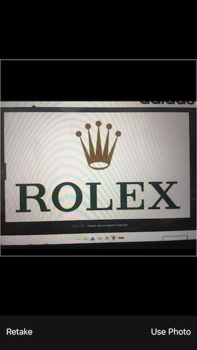
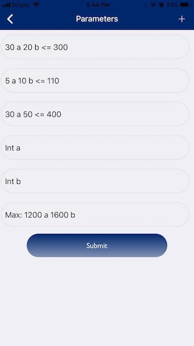
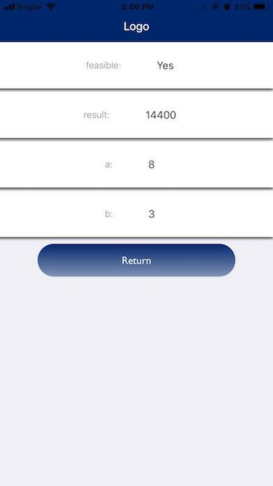

## [Engineer Workspace](https://github.com/heiseish/CN5111) for iOS and Android that build with React Native.

 
Icon made by [https://www.flaticon.com/authors/maxim-basinski] from www.flaticon.com 

## Authors: Dao Truong Giang 0143832J
- [Dao Truong Giang](https://github.com/heiseish)

## Installation
- Install [Expo Client App](https://docs.expo.io/versions/latest/introduction/installation.html) on your mobile phone.

## Run the app
- Open [Expo Client App](https://docs.expo.io/versions/latest/introduction/installation.html).
- Use the built-in QR Code scanner to scan the QR code on [Engineer Workspace](https://exp.host/@heiseish/mathsolver).
- Alternatively, press the `+` symbol on the top right-hand corner of the app and key in the following URL `https://exp.host/@heiseish/mathsolver`.

## Development
- Install [Node](https://nodejs.org/en/download/).
- Install [Yarn](https://yarnpkg.com/en/docs/install#mac-tab).
- Follow the installation steps in the React Native ["Getting Started Guide"](https://facebook.github.io/react-native/docs/getting-started.html).
- In the project folder, run `yarn install` to install dependencies.
- Run `yarn start` to launch the application.
- Use built-in QR Code scanner in [Expo Client App](https://docs.expo.io/versions/latest/introduction/installation.html) to scan the QR code generated on the CLI.

## More Information
[Engineer Workspace](https://github.com/heiseish/CN5111) is build as an individual project for CN5111.

## Project Description

### First feature

#### Problems
For engineers, it's usually necessary to take down notes or memors related to work. Whether it's a meeting minute or just a simple note reminder to oneself, it's often a hassle to keep everything organized and easily accessible when needed
#### Solutions
To optimize the time spent with recording and keeping track of notes, __Engineering Workspace__ allows user to take picture of handwritten notes taken and to save it inside the app. To make things even easier, the notes can be categorize into different agenda, making the need to access any certain note even more convenient than before

#### Description
Using the later Optical Character Recognitition (OCR) technilogy by Google (_inc_) Vision API which uses image processing techniques and machine learning algorithm to categorize text.

### How to use
1. Scan an image of handwritten notes
2. The text within the image should be captured. After that, the user will be directed to a screen where they can edit the notes captured and add/change the title for the note.
3. Just to make sure that the note is error-free before saving it!
4. Press `Submit` to save the note.
5. The note should now be saved in the workspace screen. Tap on the title that you just set for the note and the note will appear in the list along with the date and time of its creation.

 

### Second feature

#### Problem
It's usually required to maintenance engineer to fix and replace equipment. Nevertheless, with the advent of more and more brands coming into the industry, it often proves to be difficult to keep track of all equipment brands and be able to buy new equipments of that certain brand to replace the old ones.

#### Solutions
Using logo detection api, the popular brand logos can be scanned and recognized. Any brand logo recognize by the phone camera will output the name of the bnrand. The detection of logo can be implemented using neural network trained with thousands of samples to detect the array of pixels for any photos.

#### How to use
1. Press on the `Detect` button to start scanning images.
2. Take a picture from camera or use any photos from photo library to be used for scanning. Once the image is confirmed, it will be sent for processing.
3. If the brand logo is legit and recognized by Vision Api, the brand name will appear shortly after. 
4. Otherwise the result will says `Not found`

Sample case: Google search `brand logos` and start use the feature to scan any logo. If the brand logo is legit, the brand name will appear

 

### Third feature

#### Problem
Optimization is one of the most important skills for any engineer in his/her career. With numerous tasks to optimize everyday, an engineer often finds himself in need of a _mobile_ calcultor, that is _able to solve (Mixed Integer) Linear Programming_.

#### Solutions
Using the text detection API again, the app could quickly capture the equations to solve the optimization problems. Of course naturally due to worn camera condition, unique handwritting patterns and unoptimal lightning condition, the recognition might deviate from the actually handwritten equation. But fret not, user will be allow to edit and add in new constraint/object/other conditions to the task.

#### How to use
Given an _sample optimization problem_ 
>You run a small custom furniture shop and make custom tables and dressers.
Each week you're limited to 300 square feet of wood, 110 hours of labor, and 400 square feet of storage.
A table uses 30sf of wood, 5 hours of labor, requires 30sf of storage and has a gross profit of $1,200. A dresser uses 20sf of wood, 10 hours of work to put together, requires 50 square feet to store and has a gross profit of $1,600.
How much of each do you product to maximize profit, given that partial furniture isn't allowed in this problem?

In order for the app to recognize and solve the problem, you need to follow the following format:
>_Note_: To avoid recognition problem and improve the problem solving speed, try to use a single letter to represent a variable (preferably Capitalized!)

In this problem, I will use `a` to represent a `table` and `b` to represent a`dresser`

* Objective fucntion: `max: 1200 a 1600 b` 

Explanation: `max`/`min` followed by `:` and the profit of respective variable as well as their name

* Contraint functions: 
`30 a 20 b <= 300`

`5 a 10 b <= 110`

`30 a 50 b <= 400`

Explanation: The first line request the constraint for wood ( <= 300) and its requirement to produce 1 table (`30`) or 1 dresser(`20`). Similarly, the subsequent lines represents labor and storage

* Optional condition for mixed integer problem:
`int a`

`int b`

In order to specify any variable as integer, just indicate the word `int` in front of the variable names.

So in oder to solve the above problem, present it the following way on paper (order of the line doesn't matter):

`max: 1200 a 1600 b`

`30 a 20 b <= 300`

`5 a 10 b <= 110`

`30 a 50 b <= 400`

`int a`

`int b`

Once the camerat capture the picture, user will be directed to a form where he/she can edit/add in constraint equations that are not captured/captured wrongly by the camera.
//TODO: Add ability of remove constraint equation added by mistakes.
After confirming the details, the result screen will appear:

To solve any other MILP problem, just follow the above format and make sure the same format is correctly used.
 

> __Notes__: the mobile is using a paid Google Vision Api that charges per request sent. Please restraint from sending too many image requests for processing.
- Make sure the letter `O` (`o` capitalized) and the number `0` are correctly placed in the math form. The application uses text recognition to reformat and convert it to solvable JSON format so any mistake between the letter and number `0` could give a null result.
- _TIP_: 
+ When writing on paper, it's better to write the letters in CAP as the Vision Api is better at recognizing capitalized handwritten text (except for digital text, which should be easily recognizable by the algorithm), then the user can just use either lower case or uppser case letter from the form onwards.
+ Write eligibly so the app could recognize better!

